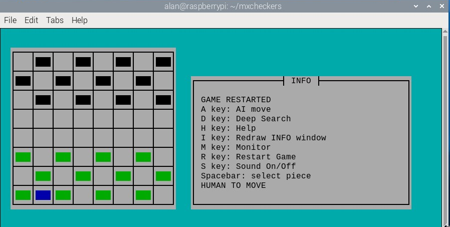
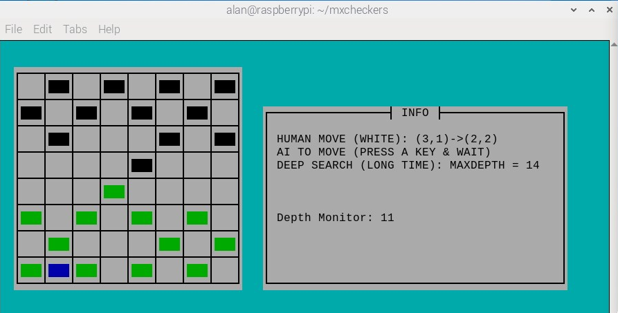
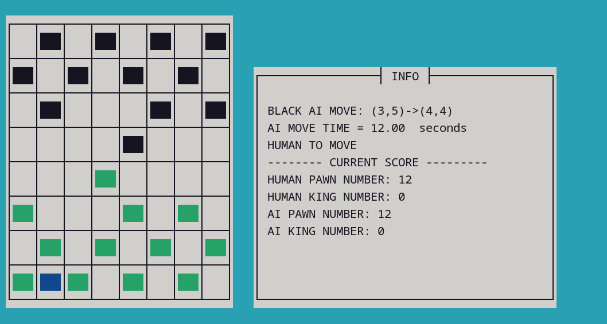
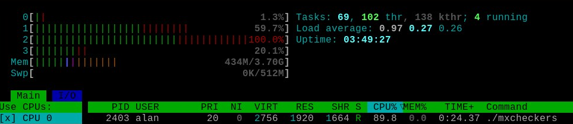

# Mx Checkers

Mx (Mx for  ***M*** inima ***x*** ) Checkers is a demo of the classic human-vs-computer checkers game for Linux computers. 

It can be run from the terminal and uses ncurses for the user interface so that Mx Checkers can be played by users who [ssh](https://www.geeksforgeeks.org/ssh-command-in-linux-with-examples/) into their computer.

A screenshot of Mx Checkers is shown below running on a Raspberry Pi.

 

## Checkers Rules

Checkers is a two-player strategy game played on an 8×8 checkerboard which involve diagonal moves of circular game pieces and mandatory captures by jumping over opponent pieces. In Britain, American checkers is known as Draughts.

In checkers there are two opponents on opposite sides of the game board. One player is called the white player and the other is called the black player (computer AI in this case). White moves first, then players take alternate turns. Obviously, the white player cannot move the black player's pieces and vice versa. In this game the white pieces are coloured green. Ncurses only supports 8 colours. 

A move consists of moving a piece forward to a diagonal adjacent unoccupied square. If the adjacent square contains an opponent's piece, and the square immediately beyond it is unoccupied, then the opponent piece must be captured and is removed from the game by jumping over it. This is called a jump move. A piece can only move forward into an unoccupied square. When jumping an opponent's piece is possible then this must be done and can involve multiple jumps. 

When a piece reaches the other end of the board it becomes a king and can move and capture diagonally in all directions.

### Pre-built Game Executables

Pre-built  game executables for Mx Checkers are available for the Raspberry Pi4 and Intel x86 Linux computers and can be downloaded from the binary folder.

If using a terminal (e.g. when you  ssh into a Raspberry  Pi) you can use [git clone](https://www.w3schools.com/git/git_clone.asp?remote=github) to get a copy of the repository and then [cd](https://www.geeksforgeeks.org/cd-command-in-linux-with-examples/) into the binary directory a then use [tar]([How to Compress Files in Linux | Tar Command - GeeksforGeeks](https://www.geeksforgeeks.org/tar-command-linux-examples/)) to decompress. For example, on the Raspberry Pi to download and decompress Mx Checkers version 0.1.1 you use

```
git clone https://github.com/crispinprojects/mxcheckers.git
cd mxcheckers
cd binary
tar -xzvf mxcheckers-v011-rpi4.tar.gz 
```

If git is not installed then use the command below.

```
sudo apt install git
```

Install ncurses by using the command below.

```
sudo apt install libncurses-dev
```

The checkers binary must have executable permissions. Use the command below if necessary.

```
chmod +x mxcheckers
```

The Mx Checkers executable can be run from a terminal as shown below.

```
./mxcheckers
```

For sound, the wav files should be located in the same directory the executable.

## Usage

This is a human-vs-computer game. You (the human player) first move a player piece on the board. To do this use the keyboard arrow keys to move the blue cursor to the start piece position and press the space-bar to select. Then move the blue cursor to the end piece position on the board and then press the space-bar again to select the end point. So, ***move to start location and press space-bar and then move to end location and press space-bar***.  The cursor is returned to the bottom left of the board after a move has been made (i.e. x=1, y=0). Press the ***A key*** (A for AI) with caps lock off to get the built-in AI to respond to your move. Make sure cap-lock is off before pressing the A key. The cursor colour is blue, the human (white) player is light green and the AI is black.

If the human player can make a multiple jump then you jump the first piece and then jump the second piece and so on. The AI can also make multiple jumps. You press the A Key again. Information on the current state of play is shown in an information window next to the checker board. If you get a "white illegal move" it usually means that you have to jump elsewhere or you have tried to move to a position which is not allowed. Start the move again.

When a piece reaches the other end of the board it becomes a king and the piece is given a diamond crown.

### Keys

```
A key: AI move
D key: Deep search (toggles on and off)
H key: Help
I key: Redraw INFO window
M key: Monitor On/off
R key: Restart game
S key: Sound On/Off
Space-bar: Select piece at cursor position
cntl+C: Quit
```

If you resize the terminal window and the INFO display disappears you can press the  I key (caps lock off) to restart the info display.

Use cntl+C to finish.

## AI

The AI uses a [minimax](https://en.wikipedia.org/wiki/Minimax) algorithm. There is a MIT OpenCourseWare lecture on the minimax algorithm [here](https://www.youtube.com/watch?v=STjW3eH0Cik&t=13s).  The minimax algorithm used in Mx Checkers takes piece capture mechanics into account.

In the minimax algorithm the depth limit specifies the number of turns to look ahead in the game (search) tree. A higher depth provides a greater chance of playing a better move. However, the minimax algorithm becomes slow when using a large search depth. With Mx Checkers you can toggle the depth search limit using the D Key (caps lock off). This toggles the deep-search mode (maximum depth set to 14) on and off from its normal limit of 10.

 

## Build From Source

The C source code for Mx Checkers is provided in the src directory. 

To compile you need to install the ncurses library as shown below.

```
sudo apt-get update
sudo apt install build-essential
sudo apt install libncurses-dev
```

To determine which version of ncurses is installed use the following command.

```
dpkg -l '*ncurses*' | grep '^ii'
```

Use the MAKEFILE to compile. 

```
make
```

To run Mx Checkers from the terminal use

```
./mxcheckers
```

For sound make sure the wav files are in the same directory as the executable.

Mx Checkers can be compiled on any Linux system once the ncurses library has been installed. [Geany](https://www.geany.org/) was used as the  code editor for developing this project.

Make clean is also supported.

```
make clean
```

### Search Time Performance

The time taken for each AI move is now displayed as shown below. 

 

When using the deep search mode the search time performace of Mx Checkers is slow especially when using ARM and Intel entry level processors. The CPU benchmark comparisons for the ARM Cortex-A72 used in the Raspberry Pi4 and the Intel N100 used in many Linux based mini computers can be found [here](https://www.cpubenchmark.net/compare/4956vs5157/ARM-Cortex-A72-4-Core-1200-MHz-vs-Intel-N100). You can switch between normal and deep search mode during a game by pressing the D key which toggles between standard and deep search modes. Future work will explore if bitboard methods, threads, parallel programming can improve performance.

[Htop](https://htop.dev/) is an interactive system monitor and process viewer for Linux systems and can be used to monitor processor activity when using the deep-search mode. With Debian based distros you can install it using the command below.

```
sudo apt install htop
```

The htop screenshot below shows MX Checkers running in deep search mode on a raspbery Pi 4.

 

## Version Control

[SemVer](http://semver.org/) is used for version control. The version number has the form 0.0.0 representing major, minor and bug fix changes.

The code will be updated as and when I find bugs or make improvement to the code base.

## Author

* **Alan Crispin** [Github](https://github.com/crispinprojects)

## License

Minimax Checkers is licensed under LGPL v2.1. 

## Project Status

Active.

## Acknowledgements

* [Geany](https://www.geany.org/) is a lightweight source-code editor [GPL v2 license](https://www.gnu.org/licenses/old-licenses/gpl-2.0.txt)

* [MIT OpenCourseWare Lecture. Search: Games, Minimax and Alpha-Beta](https://www.youtube.com/watch?v=STjW3eH0Cik&t=13s)

* [Raspberry Pi Foundation](https://www.raspberrypi.org/)

* [DroneBot Workshop: Raspberry Pi Remote Access - 3 Methods](https://www.youtube.com/watch?v=l4VDWhKsFgs)
