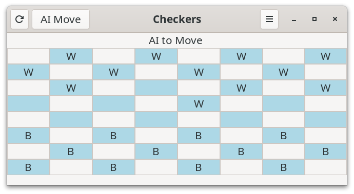
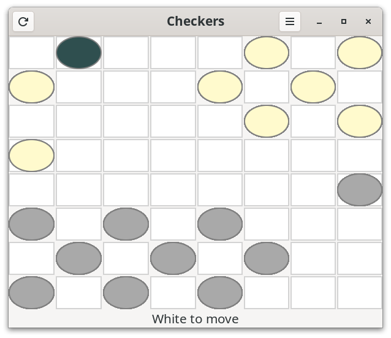

# GTK4 Checkers 

GTK4 Checkers is a demo of the classic human-vs-computer checkers game. It has been  developed using C and [GTK4](https://docs.gtk.org/gtk4/). 

A screenshot is shown below.

 

## Checkers Rules

Checkers is played by two opponents on opposite sides of the game board. One player is white and the other is black (computer AI in this case). White moves first, then players take alternate turns. Obviously, the white player cannot move the black player's pieces and vice versa.

A move consists of moving a piece forward to a diagonal adjacent unoccupied square. If the adjacent square contains an opponent's piece, and the square immediately beyond it is unoccupied, then the opponent piece must be captured and is removed from the game by jumping over it. This is called a jump move. A piece can only move forward into an unoccupied square. When jumping an opponent's piece is possible then this must be done and can involve multiple jumps. 

When a piece reaches the other end of the board it becomes a king and can move and capture diagonally in all directions.

### Prebuilt Binary

A 64 bit prebuilt binary is available and can be downloaded from the binary folder. This has been built using Debian 12 Bookworm. Download and extract. The checkers executable can be run from a terminal as shown below.

```
./checkers
```

The checkers binary must have executable permissions. Use the command below if necessary.

```
chmod +x checkers
```

To add Checkers to the system menu modify the "checkers.desktop" file provided in the download using your user name and application location and copy it to the ***.local/share/applications/*** directory.

This way of locally installing Checkers should be universal across different Linux distributions.

## Usage

This is a player-vs-computer game. You (the player) move a white piece on the board by first mouse clicking on the piece start position and then clicking on the piece end position. The build-in AI responds with a black move.

If the white (human) player can make a multiple jump then you jump the first piece and then jump the second piece and so on. The AI prioritises multiple jumps over single jumps when both are available. If you get a "white illegal move" it usually means that you have to jump elsewhere or you have tried to move to a position which is not allowed. Click on another white piece to restart move.

When a piece reaches the other end of the board it becomes a king and its colour changes as shown below.

 

## AI

The AI uses a priority move algorithm and recursion for multiple jumps.

## Build From Source

The C source code for GTK4 checkers is provided in the src directory. The code uses GtkCssProvider and the gtk_widget_add_css_class for drawing the checkers pieces.

With both  Debian Bookworm and Ubuntu and you need to install the following packages to build GTK Checkers.

```
apt install build-essential
apt install libgtk-4-dev
```

The package:

```
apt install libglib2.0-dev
```

is needed but should be installed by default.

Use the MAKEFILE to compile. 

```
make
```

To run Checkers from the terminal use

```
./checkers
```

I have used Geany for developing the code which is a lightweight source-code editor with an integrated terminal. 


## Versioning

[SemVer](http://semver.org/) is used for versioning. The version number has the form 0.0.0 representing major, minor and bug fix changes.

## Author

* **Alan Crispin** [Github](https://github.com/crispinprojects)

## License

GTK4 Checkers is licensed under LGPL v2.1. 

## Project Status

Active.

## Acknowledgements

* [GTK](https://www.gtk.org/)

* GTK is a free and open-source project maintained by GNOME and an active community of contributors. GTK is released under the terms of the [GNU Lesser General Public License version 2.1](https://www.gnu.org/licenses/old-licenses/lgpl-2.1.html).

* [GTK4 API](https://docs.gtk.org/gtk4/index.html)

* [GObject API](https://docs.gtk.org/gobject/index.html)

* [Glib API](https://docs.gtk.org/glib/index.html)

* [Gio API](https://docs.gtk.org/gio/index.html)

* [Geany](https://www.geany.org/) is a lightweight source-code editor (version 2 now uses GTK3). [GPL v2 license](https://www.gnu.org/licenses/old-licenses/gpl-2.0.txt)


