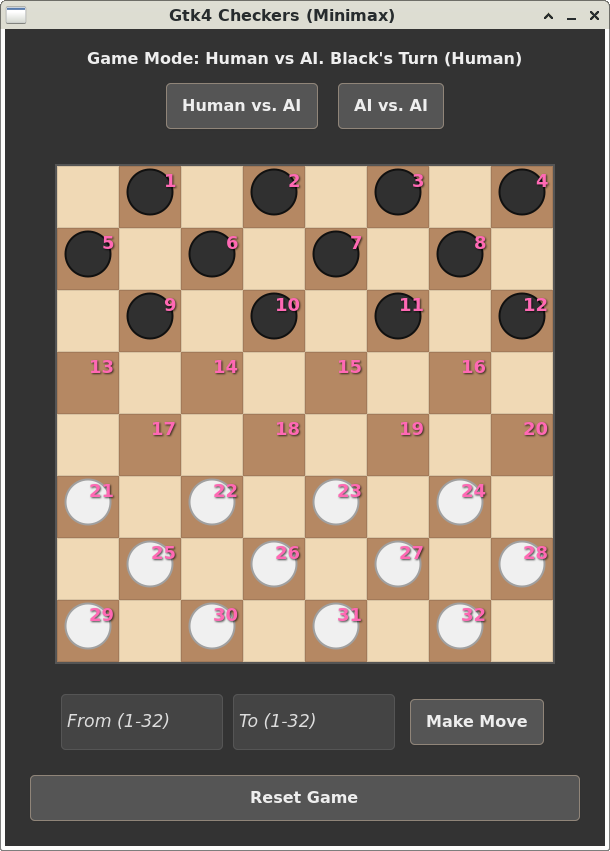

# Gtk4 Checkers

Gtk4 Checkers is a demo of the classic human-vs-computer checkers game for Linux computers. 

A screenshot of Gtk4 Checkers is shown below 

 

## Checkers Rules

Checkers is a two-player strategy game played on an 8×8 checkerboard which involve diagonal moves of circular game pieces and mandatory captures by jumping over opponent pieces. In Britain, American checkers is known as Draughts.

In checkers there are two opponents on opposite sides of the game board. One player is called the white player and the other is called the black player (computer AI in this case). White moves first, then players take alternate turns. Obviously, the white player cannot move the black player's pieces and vice versa. In this game the white pieces are coloured green. Ncurses only supports 8 colours. 

A move consists of moving a piece forward to a diagonal adjacent unoccupied square. If the adjacent square contains an opponent's piece, and the square immediately beyond it is unoccupied, then the opponent piece must be captured and is removed from the game by jumping over it. This is called a jump move. A piece can only move forward into an unoccupied square. When jumping an opponent's piece is possible then this must be done and can involve multiple jumps. 

When a piece reaches the other end of the board it becomes a king and can move and capture diagonally in all directions.

### Pre-built Game Executables

Pre-built  game executable for Gtk4 Checkers is available for the  Intel x86 Linux computers and can be downloaded from the binary folder. It has been tested using Debian 13 with Gtk 4.18.


## Usage

Enter diagonal move coordinates to make a human move. A computer AI vs computer AI mode is also supported and should always result in a draw.


## AI

The AI uses a [minimax](https://en.wikipedia.org/wiki/Minimax) algorithm. There is a MIT OpenCourseWare lecture on the minimax algorithm [here](https://www.youtube.com/watch?v=STjW3eH0Cik&t=13s).  The minimax algorithm used in Gtk4 Checkers takes piece capture mechanics into account.


## Build From Source

The C source code for Gtk4 Checkers is provided in the src directory. 

You need to install the following packages.

```
sudo apt-get update
sudo apt install build-essential
sudo apt install libgtk-4-dev
```

Use the MAKEFILE to compile. 

```
make
```

To run Gtk4 Checkers from the terminal use

```
./checkers
```

Make clean is also supported.

```
make clean
```

## Version Control

[SemVer](http://semver.org/) is used for version control. The version number has the form 0.0.0 representing major, minor and bug fix changes.

The code will be updated as and when I find bugs or make improvement to the code base.

## Author

* **Alan Crispin** [Github](https://github.com/crispinprojects)


## Project Status

Active.

## Acknowledgements

* [Geany](https://www.geany.org/) is a lightweight source-code editor [GPL v2 license](https://www.gnu.org/licenses/old-licenses/gpl-2.0.txt)

* [MIT OpenCourseWare Lecture. Search: Games, Minimax and Alpha-Beta](https://www.youtube.com/watch?v=STjW3eH0Cik&t=13s)


